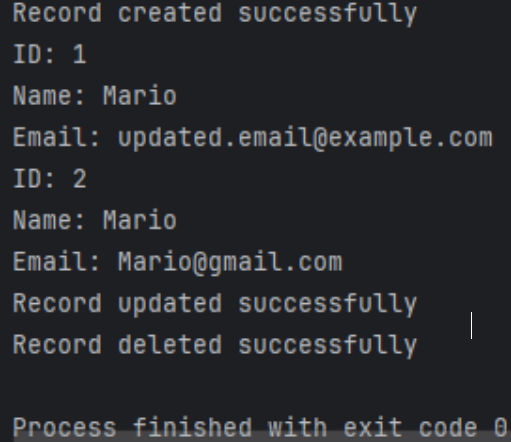

# JDBC-TBirt
Java application that demonstrates the use of JDBC for connecting to a MySQL database.
### Week 3 Assignment 1
### JDBC and Database Connectivity
### Thomas Birt
### April 5, 2024

## *How to setup and run your Java Application*

Start up the MySQL command-line client. Create the Database, ‘sampledb’ and the specified user with privileges as stated in the Java application. The default Java username and password would be 't_birt' and 'test’.

We can connect to ‘sampledb’ and select the database with the USE command:

Our command below will create a table named ‘users’ with the columns (id, name, and email). Our id will each include an auto-incrementing primary key, while name and email columns are of type VARCHAR with a limit of 255 (String for mySQL) and cannot be null. UNIQUE will ensure that every email address is different in the table.

From there I have created a new Project in Intellij and opened Project Structure to add a new Project Library from Maven.

Now we should be able to run and create, read, update, and delete our new query!

## NoSQL Overview

### Advantages
1. Flexible data models
   - A flexible schema allows you to easily make changes to your database as requirements change.
   
   - You can iterate quickly and still integrate new application features to be able provide value faster.
2. Horizontal scaling
   - Most SQL databases require you to scale-up vertically and move to a larger, more expensive server after exceeding the capacity requirements.
   
   - NoSQL databases allow you to scale-out horizontally where you can add cheaper commodity servers whenever you need to.
3. Fast queries
   - Queries in NoSQL databases can be faster than SQL databases. Data in NoSQL databases is typically stored in a way that is optimized for queries.
     
   - NoSQL queries do not require joins, making it faster.
     
   - As your tables grow in size, it can become expensive.
     
   - NoSQL databases allow you to scale-out horizontally where you can add cheaper commodity servers whenever you need to.
4. Easy for developers
   - Some NoSQL languages map their data structures to those of popular programming languages.
     - It allows developers to store their data in the same way that they would use in their application code. This often leads to writing less code, leading to faster development time and fewer bugs.

### Type of NoSQL databases

#### Document databases
A document database stores data in JSON, BSON, or XML documents. 
- Documents in the database can be nested. Some elements can be indexed for faster querying.
  
- Document databases are usually created with a scale-out architecture, providing a path to the scalability of data traffic.
  
- Use cases include eCommerce platforms, trading platforms, and mobile app development.

#### Key-value stores
Every element is stored as a key-value pair consisting of an attribute name ("key") and a value. 

- Use cases for NoSQL databases include shopping carts, user preferences, and user profiles.

#### Column-oriented databases

Whereas RDBMS stores data in rows and reads it row by row, column-oriented databases are organized as a set of columns. 
- You can read columns directly without consuming memory with unwanted data.
  - Columns benefit from more efficient compression, making reads even faster.
  
- The column-oriented database requires multiple write events on disk.
  - Relational databases don’t have as row data is written persistently to disk.
  
- Use cases of a column-oriented database include analytics.

#### Graph databases
- A graph database focuses on the relationship between data elements that are contained as nodes. 
  - The connections between elements in the database are called links or relationships.
  
- They are optimized to capture and search the connections between elements.
  
- Very little business systems can survive solely on graph databases.
  
- Use cases include fraud detection and social networks

### Use cases of NoSQL and SQL
- SQL databases are better for multi-row transactions, while NoSQL is better for unstructured data like JSON.

- NoSQL use cases include eCommerce platforms, trading platforms, and mobile app development.

- SQL databases are also commonly used for legacy systems built around a relational structure.

### Examples of popular NoSQL databases
- MongoDB is a document type database, it’s called MongoDB Query Language, it deals with Transactions, and its horizontal.

- Neo4j is a graph type database, its Query Language is named Cypher, it deals with ACID Transactions, and its horizontal. 

- Amazon DynamoDB is a Key-value and Document type database, its query language is called AQL, it deals with ACID Transactions, and its horizontal.

# Sources

mongodb.com
bairesdev.com